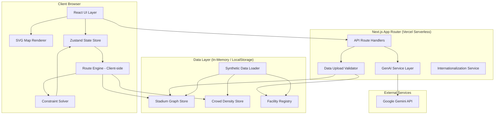
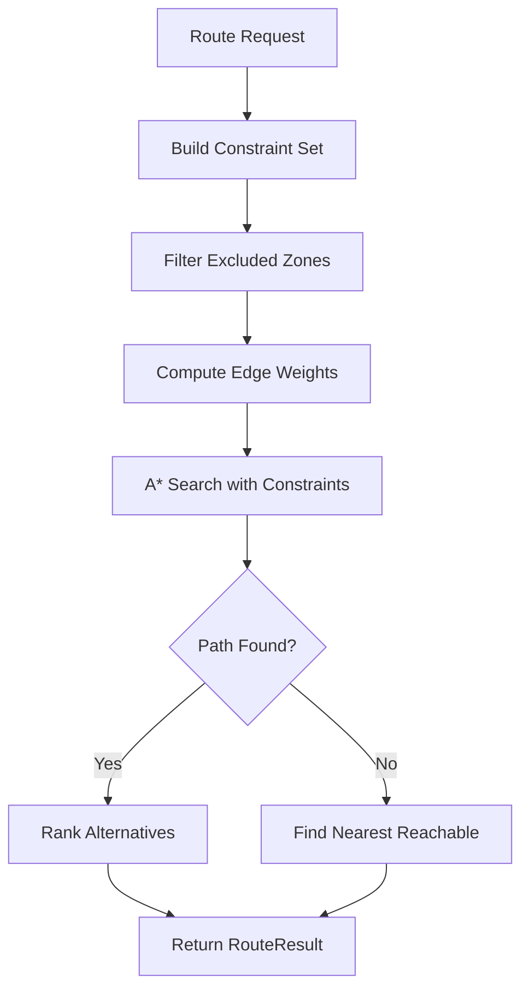
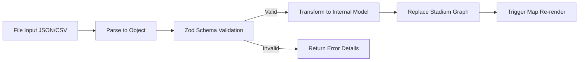

# Design Document: Smart Stadium Fan Navigator

## Overview

Smart Stadium Fan Navigator is a single-deployment web application that provides context-aware, accessibility-first navigation for FIFA World Cup 2026 stadium attendees. The system combines graph-based pathfinding with GenAI-powered reasoning to deliver optimal routes through stadiums with 80,000–90,000 capacity, accounting for crowd density, accessibility needs, group composition, fan allegiance safety, and multilingual context.

### Key Design Decisions

1. **Next.js 14+ App Router** — Enables single-deployment architecture with API routes as serverless functions on Vercel, satisfying the "no separate backend" constraint.
2. **Modified A\* Pathfinding** — A\* with dynamic edge weighting provides efficient constraint-aware routing through stadium graphs with 20+ zones.
3. **Google Gemini API with Structured Output** — Gemini's structured output mode ensures predictable JSON responses for route explanations while enforcing reasoning transparency.
4. **SVG-based Dynamic Map** — Data-driven SVG rendering (no static images) enables fully dynamic stadium visualization from uploaded data.
5. **Client-side State with React Context** — Fan profiles, group state, and session data managed client-side; no database required for core functionality.
6. **Zustand for Global State** — Lightweight state management for complex cross-component state (crowd data, routes, profiles).

## Architecture

### System Architecture Diagram



### Architecture Rationale

**Client-side Route Computation**: The pathfinding algorithm runs in the browser. Stadium graphs have ~20–50 zones (not millions of nodes), so A\* completes in milliseconds client-side. This avoids round-trip latency for route computation and keeps the architecture simple. Only GenAI reasoning requires a server-side API call (to protect the API key).

**Server-side GenAI Only**: The API route layer exists primarily to proxy Gemini API calls (protecting the API key) and to handle data upload validation. All other logic runs client-side.

**No Database**: The application uses in-memory state and browser LocalStorage. Stadium data is loaded from synthetic defaults or user uploads. This satisfies the single-deployment, no-infrastructure constraint.

### Technology Stack

| Layer | Technology | Rationale |
|-------|-----------|-----------|
| Framework | Next.js 14+ (App Router) | Single deployment, serverless API routes, React ecosystem |
| Deployment | Vercel | Zero-config deployment, serverless functions for API routes |
| Language | TypeScript | Type safety for complex data models, better IDE support |
| State Management | Zustand | Lightweight, no boilerplate, works with React Server Components |
| Map Rendering | React + SVG | Data-driven, no static images, accessible, interactive |
| Pathfinding | Custom A\* (client-side) | Small graphs, fast execution, constraint-aware weighting |
| GenAI | Google Gemini API (via @google/generative-ai SDK) | Structured output, multilingual, reasoning capability |
| Styling | Tailwind CSS | Utility-first, responsive, accessible patterns |
| Testing | Vitest + fast-check | Fast execution, property-based testing for algorithms |
| Internationalization | next-intl or custom i18n | 8+ language support with GenAI-assisted translation |
| Data Validation | Zod | Runtime schema validation for uploads and API responses |

## Components and Interfaces

### Component Architecture Diagram

```mermaid
graph TB
    subgraph "Pages (App Router)"
        HomePage[/ - Landing / Map View]
        UploadPage[/upload - Data Upload]
    end

    subgraph "Feature Components"
        StadiumMap[StadiumMap - SVG interactive map]
        RoutePanel[RoutePanel - Route display + GenAI reasoning]
        ProfileSetup[ProfileSetup - Accessibility & allegiance config]
        GroupManager[GroupManager - Fan group management]
        FacilityFinder[FacilityFinder - Food, restroom, amenity search]
        EmergencyPanel[EmergencyPanel - SOS + medical assistance]
        DataUploader[DataUploader - JSON/CSV upload interface]
        LanguageSelector[LanguageSelector - 8+ language picker]
    end

    subgraph "Core Services (Client-side)"
        RouteEngineService[RouteEngine - A* pathfinding + constraints]
        ConstraintMerger[ConstraintMerger - Group constraint resolution]
        CrowdMonitor[CrowdMonitor - Density data management]
        FacilityRegistry[FacilityRegistry - Facility search + filtering]
        SOSService[SOSService - Emergency alert handling]
    end

    subgraph "API Routes (Server-side)"
        GenAIRoute[/api/genai/reason - Route explanation]
        GenAIFacility[/api/genai/recommend - Facility recommendation]
        GenAITriage[/api/genai/triage - Medical triage guidance]
        UploadRoute[/api/upload - Data upload processing]
        SOSRoute[/api/sos - Emergency alert transmission]
    end

    HomePage --> StadiumMap
    HomePage --> RoutePanel
    HomePage --> ProfileSetup
    HomePage --> GroupManager
    HomePage --> FacilityFinder
    HomePage --> EmergencyPanel
    UploadPage --> DataUploader
```

### Key Interfaces

```typescript
// === Route Engine Interface ===
interface RouteEngine {
  computeRoute(request: RouteRequest): RouteResult;
  computeGroupRoute(request: GroupRouteRequest): RouteResult;
  findAlternatives(request: RouteRequest, count: number): RouteResult[];
}

interface RouteRequest {
  source: ZoneId;
  destination: ZoneId;
  profile: AccessibilityProfile;
  allegiance: FanAllegiance;
  constraints: RouteConstraints;
}

interface GroupRouteRequest extends RouteRequest {
  groupConstraintSet: GroupConstraintSet;
}

interface RouteResult {
  path: ZoneId[];
  estimatedTime: number; // seconds
  distance: number; // meters
  zonesTraversed: number;
  densityScore: number; // composite crowd score along path
  warnings: RouteWarning[];
  status: 'found' | 'no_route' | 'partial';
  alternativeDestination?: ZoneId; // if no_route, nearest reachable
}

// === Constraint Solver Interface ===
interface ConstraintSolver {
  mergeProfiles(profiles: AccessibilityProfile[]): GroupConstraintSet;
  isZoneAllowed(zone: Zone, constraints: RouteConstraints): boolean;
  isEdgeTraversable(edge: GraphEdge, constraints: RouteConstraints): boolean;
  getEdgeWeight(edge: GraphEdge, constraints: RouteConstraints, density: DensityMap): number;
  identifyConflicts(constraints: GroupConstraintSet): ConstraintConflict[];
}

// === GenAI Service Interface ===
interface GenAIService {
  explainRoute(context: RouteExplanationContext): Promise<GenAIResponse>;
  recommendFacility(context: FacilityRecommendationContext): Promise<GenAIResponse>;
  triageMedical(symptoms: string, location: ZoneId): Promise<TriageResponse>;
  proactiveWarning(context: ProactiveContext): Promise<GenAIResponse>;
}

interface GenAIResponse {
  reasoning: string; // Natural language explanation
  dataPoints: DataPoint[]; // Quantitative data referenced
  language: LanguageCode;
  confidence: number;
}

// === Facility Registry Interface ===
interface FacilityRegistry {
  search(query: FacilityQuery): Facility[];
  getQueueEstimate(facilityId: string): QueueEstimate;
  filterByDietary(filters: DietaryFilter[]): Facility[];
  filterByType(type: FacilityType): Facility[];
  getNearestByType(type: FacilityType, fromZone: ZoneId): Facility | null;
}

// === Crowd Monitor Interface ===
interface CrowdMonitorService {
  getDensity(zoneId: ZoneId): DensityLevel;
  getAllDensities(): DensityMap;
  updateDensity(zoneId: ZoneId, level: number): void;
  isStale(zoneId: ZoneId): boolean; // >60s since last update
  bulkUpdate(data: DensityUpdate[]): void;
}

// === SOS Service Interface ===
interface SOSServiceInterface {
  sendAlert(alert: SOSAlert): Promise<SOSResult>;
  activateLostChild(protocol: LostChildProtocol): Promise<SOSResult>;
  getEmergencyRoute(fromZone: ZoneId): RouteResult; // shortest to medical
}
```

### Route Engine Algorithm Design

The Route Engine uses a modified A\* algorithm with dynamic edge weighting:



**Edge Weight Formula:**

```
weight(edge) = base_distance 
  + density_penalty(target_zone) 
  + accessibility_penalty(edge, profile)
  + safety_penalty(target_zone, allegiance)
```

Where:
- `base_distance`: Physical distance in meters between zone centers
- `density_penalty`: `0` if density ≤ 40, `distance * 0.5` if 41–70, `distance * 2.0` if 71–80, `Infinity` if > 80 (triggering reroute)
- `accessibility_penalty`: `Infinity` if edge violates hard constraints (stairs for wheelchair), `distance * 0.3` for soft preference violations
- `safety_penalty`: `Infinity` if zone violates allegiance exclusion, `distance * 1.5` for buffer zone proximity

**Constraint Priority Order** (from requirements 3.25):
1. Safety constraints (zone exclusions, allegiance) — hard block
2. Physical access constraints (step-free, distance limits) — hard block
3. Comfort preferences (quiet route, proximity to facilities) — soft weight increase

### GenAI Integration Pattern

**Prompt Structure for Route Reasoning:**

The GenAI service constructs structured prompts that include:
1. Route context (source, destination, path taken, alternatives considered)
2. Constraint context (why certain zones were excluded)
3. Quantitative data (density levels, distances, queue times)
4. Language/tone instructions

```typescript
// Prompt template structure (not the actual prompt, illustrative)
interface RouteExplanationContext {
  route: RouteResult;
  alternatives: RouteResult[];
  constraints: RouteConstraints;
  crowdData: DensityMap;
  language: LanguageCode;
  fanProfile: {
    accessibility: AccessibilityProfile;
    allegiance: FanAllegiance;
    groupSize?: number;
  };
}
```

**Gemini Structured Output**: The API is called with `responseMimeType: "application/json"` and a JSON schema enforcing the `GenAIResponse` structure. This ensures every response includes reasoning text and at least one quantitative data point.

**Response Time Budget**: The GenAI call must complete within 5 seconds. The UI shows the computed route immediately while the explanation loads asynchronously. If the call times out, the fallback message is shown.

### Data Upload Pipeline



**Validation Steps:**
1. File format detection (JSON vs CSV based on content/extension)
2. Schema validation with Zod (required fields, types, relationships)
3. Structural validation (≥2 connected zones, graph connectivity, required zone types)
4. Referential integrity (facility zone assignments reference existing zones)

## Data Models

### Stadium Graph

```typescript
type ZoneId = string;
type FacilityId = string;

interface StadiumGraph {
  zones: Map<ZoneId, Zone>;
  edges: GraphEdge[];
  facilities: Map<FacilityId, Facility>;
  metadata: StadiumMetadata;
}

interface StadiumMetadata {
  name: string;
  capacity: number;
  zoneCount: number;
  lastUpdated: string; // ISO timestamp
}

interface Zone {
  id: ZoneId;
  name: string;
  type: ZoneType;
  allegiance: 'home' | 'away' | 'neutral' | 'buffer';
  capacity: number;
  currentDensity: number; // 0-100
  lastDensityUpdate: number; // timestamp ms
  accessibilityFeatures: ZoneAccessibility;
  noiseLevel: 'low' | 'medium' | 'high';
  sensoryTriggers: SensoryTrigger[];
  isSunExposed: boolean;
  isIndoor: boolean;
  facilities: FacilityId[];
  position: { x: number; y: number }; // For map rendering
  shape: ZoneShape; // SVG path data for rendering
}

type ZoneType = 
  | 'gate' 
  | 'concourse' 
  | 'seating_section' 
  | 'concession_area'
  | 'restroom_cluster' 
  | 'medical_area' 
  | 'family_section'
  | 'accessible_seating' 
  | 'service_corridor' 
  | 'loading_dock'
  | 'smoking_area'
  | 'cooling_zone'
  | 'prayer_area';

type SensoryTrigger = 
  | 'fireworks' 
  | 'dj_booth' 
  | 'large_screen_flash' 
  | 'pyrotechnics'
  | 'loud_music';

interface ZoneAccessibility {
  stepFree: boolean;
  hasRamp: boolean;
  hasElevator: boolean;
  hasTactileIndicators: boolean;
  hasHandrails: boolean;
  hasRestArea: boolean;
  wideCorridors: boolean; // suitable for multiple wheelchairs
  maxGradient: number; // percentage
  hasWallFollowingPath: boolean;
}

interface ZoneShape {
  type: 'polygon' | 'rect' | 'circle' | 'path';
  data: string; // SVG path data or coordinate array
}
```

### Graph Edges

```typescript
interface GraphEdge {
  id: string;
  source: ZoneId;
  target: ZoneId;
  distance: number; // meters
  bidirectional: boolean;
  accessibility: EdgeAccessibility;
  type: EdgeType;
}

interface EdgeAccessibility {
  stepFree: boolean;
  hasStairs: boolean;
  hasEscalator: boolean;
  hasRamp: boolean;
  hasElevator: boolean;
  width: number; // meters - for wheelchair/group passage
  gradient: number; // percentage incline
  hasTactileIndicators: boolean;
  hasHandrails: boolean;
  maxUninterruptedDistance: number; // meters without rest area
}

type EdgeType = 'corridor' | 'ramp' | 'stairs' | 'elevator' | 'escalator' | 'outdoor_path';
```

### Facilities

```typescript
interface Facility {
  id: FacilityId;
  name: string;
  type: FacilityType;
  zone: ZoneId;
  status: 'open' | 'closed' | 'limited';
  accessibility: FacilityAccessibility;
  queueEstimate: number; // minutes
  attributes: FacilityAttributes;
}

type FacilityType =
  | 'food_stall'
  | 'water_station'
  | 'restroom_standard'
  | 'restroom_accessible'
  | 'restroom_family'
  | 'restroom_gender_neutral'
  | 'first_aid'
  | 'medical_center'
  | 'AED_station'
  | 'nursing_room'
  | 'charging_station'
  | 'prayer_room'
  | 'cooling_zone'
  | 'smoking_area'
  | 'lost_and_found'
  | 'rest_area';

interface FacilityAccessibility {
  wheelchairAccessible: boolean;
  hasSignLanguageSupport: boolean;
  hasBrailleSignage: boolean;
  familyFriendly: boolean;
}

interface FacilityAttributes {
  // Food stall specific
  dietaryOptions?: DietaryFilter[];
  cuisineType?: string;
  kidFriendly?: boolean;
  allergenInfo?: string[];
  // Restroom specific
  hasDiaperChanging?: boolean;
  hasNursingArea?: boolean;
  // Medical specific
  medicalCapability?: 'basic' | 'advanced' | 'emergency';
  hasAED?: boolean;
  // Prayer room specific
  qiblaDirection?: number; // degrees
  // General
  seatingCapacity?: number;
  isShaded?: boolean;
  hasCharging?: boolean;
}

type DietaryFilter = 
  | 'vegetarian' | 'vegan' | 'gluten_free' 
  | 'halal' | 'kosher' | 'nut_free' | 'dairy_free';
```

### Fan Profile and Groups

```typescript
interface FanProfile {
  id: string;
  accessibility: AccessibilityProfile;
  allegiance: FanAllegiance;
  language: LanguageCode;
  currentZone: ZoneId | null;
  sessionStartTime: number; // timestamp
  zoneHistory: { zone: ZoneId; enteredAt: number }[];
  recentDestinations: ZoneId[];
}

interface AccessibilityProfile {
  wheelchair: boolean;
  limitedMobility: boolean;
  deaf: boolean;
  hardOfHearing: boolean;
  blind: boolean;
  lowVision: boolean;
  companionMode: boolean; // sighted/hearing companion present
  pregnancy: boolean;
  sensorySensitivity: boolean;
  neurodivergent: boolean;
  childAccompaniment: boolean;
  allergens: string[];
}

type FanAllegiance = 'home' | 'away' | 'neutral';

type LanguageCode = 
  | 'en' | 'es' | 'fr' | 'ar' | 'pt' | 'de' | 'ja' | 'zh';

interface FanGroup {
  id: string;
  members: FanGroupMember[];
  allegiance: FanAllegiance;
  constraintSet: GroupConstraintSet;
}

interface FanGroupMember {
  id: string;
  name: string;
  profile: AccessibilityProfile;
}

interface GroupConstraintSet {
  // Merged from all member profiles - weakest link
  requiresStepFree: boolean;
  requiresShortRoutes: boolean;
  maxWalkingDistance: number; // meters - min of all members
  requiresQuietRoute: boolean;
  avoidAlcoholZones: boolean;
  avoidAdultZones: boolean;
  avoidSensoryTriggers: SensoryTrigger[];
  requiresRestAreas: boolean;
  restAreaInterval: number; // meters - min of all members
  requiresNearRestroom: boolean;
  avoidServiceCorridors: boolean;
  requiresWidePaths: boolean;
  hasChild: boolean;
  allergens: string[]; // union of all member allergens
}
```

### Route Constraints

```typescript
interface RouteConstraints {
  // Hard constraints (zone exclusion)
  excludedZones: Set<ZoneId>;
  excludedZoneTypes: Set<ZoneType>;
  excludedAllegiances: Set<'home' | 'away' | 'buffer'>;
  
  // Hard edge constraints
  requireStepFree: boolean;
  maxGradient: number;
  maxEdgeWidth?: number; // minimum width required
  
  // Soft preferences (affect weight, don't exclude)
  preferQuiet: boolean;
  preferShort: boolean;
  preferNearRestrooms: boolean;
  preferNearRestAreas: boolean;
  preferFamilySections: boolean;
  preferTactileIndicators: boolean;
  preferHandrails: boolean;
  maxUninterruptedDistance: number; // meters
  maxTotalDistance: number; // meters
  avoidSmoking: boolean;
  avoidSunExposed: boolean;
}

// Crowd density data
interface DensityMap {
  densities: Map<ZoneId, DensityLevel>;
  lastGlobalUpdate: number; // timestamp
}

interface DensityLevel {
  value: number; // 0-100
  lastUpdated: number; // timestamp ms
  isStale: boolean; // >60s since update
}

interface DensityUpdate {
  zoneId: ZoneId;
  density: number;
  timestamp: number;
}
```

### Emergency and SOS Models

```typescript
interface SOSAlert {
  fanId: string;
  currentZone: ZoneId;
  timestamp: number;
  type: 'medical' | 'security' | 'general';
  description?: string;
  status: 'pending' | 'sent' | 'failed' | 'acknowledged';
}

interface LostChildProtocol {
  fanId: string;
  currentZone: ZoneId;
  childDescription: {
    age: number;
    clothingDescription: string;
    lastKnownZone: ZoneId;
  };
  timestamp: number;
  status: 'active' | 'resolved';
}

interface TriageResponse {
  recommendation: 'water_station' | 'first_aid' | 'medical_center';
  reasoning: string;
  nearestFacility: {
    id: FacilityId;
    zone: ZoneId;
    estimatedTime: number;
    distance: number;
  };
  urgencyLevel: 'low' | 'medium' | 'high';
  disclaimer: string; // Always present: "This is not medical advice..."
}
```

### Upload Data Schemas (Zod Validation)

```typescript
// Schema for uploaded stadium data validation
const StadiumUploadSchema = z.object({
  zones: z.array(z.object({
    id: z.string(),
    name: z.string(),
    type: z.enum([/* ZoneType values */]),
    allegiance: z.enum(['home', 'away', 'neutral', 'buffer']),
    capacity: z.number().positive(),
    connections: z.array(z.string()), // adjacent zone IDs
    accessibilityFeatures: z.object({/* ... */}),
    noiseLevel: z.enum(['low', 'medium', 'high']),
    facilities: z.array(z.string()).optional(),
    position: z.object({ x: z.number(), y: z.number() }),
  })).min(2), // minimum 2 connected zones
  
  facilities: z.array(z.object({
    id: z.string(),
    type: z.enum([/* FacilityType values */]),
    zone: z.string(), // must reference existing zone
    dietaryOptions: z.array(z.string()).optional(),
    restroomType: z.string().optional(),
    medicalCapability: z.string().optional(),
  })).optional(),

  edges: z.array(z.object({
    source: z.string(),
    target: z.string(),
    distance: z.number().positive(),
    accessibility: z.object({/* ... */}),
  })),
});
```

## Correctness Properties

*A property is a characteristic or behavior that should hold true across all valid executions of a system — essentially, a formal statement about what the system should do. Properties serve as the bridge between human-readable specifications and machine-verifiable correctness guarantees.*

### Property 1: Route Existence Completeness

*For any* valid connected stadium graph and any pair of source and destination zones that are connected (considering only hard constraints), the Route Engine SHALL return a path with status 'found', and that path SHALL consist of a sequence of adjacent zones in the graph.

**Validates: Requirements 1.1**

### Property 2: Route Optimality Ordering

*For any* stadium graph with multiple distinct paths between source and destination, the Route Engine SHALL return alternatives ordered by non-decreasing composite score (travel time + density penalty), such that the first path has the lowest score.

**Validates: Requirements 1.2**

### Property 3: High-Density Zone Avoidance

*For any* stadium graph where the shortest path passes through a zone with Density_Level > 80 AND an alternative path exists avoiding that zone, the Route Engine SHALL return a primary route that does not traverse the high-density zone.

**Validates: Requirements 1.3**

### Property 4: Route Result Structural Completeness

*For any* successful route computation (status 'found'), the RouteResult SHALL contain estimatedTime > 0, distance > 0, and zonesTraversed equal to the length of the path array.

**Validates: Requirements 1.4**

### Property 5: Unreachable Destination Alternative Suggestion

*For any* stadium graph and source-destination pair where no valid path exists (due to disconnection, constraints, or zone closure), the Route Engine SHALL return status 'no_route' and suggest an alternativeDestination that IS reachable from the source and is the nearest reachable zone to the original destination.

**Validates: Requirements 1.5, 3.3, 4.5, 12.3**

### Property 6: Wheelchair Step-Free Constraint Enforcement

*For any* stadium graph and route request where the fan's Accessibility_Profile has wheelchair=true, every edge in the returned path SHALL have stepFree=true, and no zone in the path SHALL require traversal of stairs or escalators without elevator/ramp alternative.

**Validates: Requirements 3.1**

### Property 7: Limited Mobility Distance Constraint

*For any* stadium graph and route request with limited mobility profile, no edge in the returned path SHALL have maxUninterruptedDistance exceeding 200 meters unless no alternative path to the destination exists.

**Validates: Requirements 3.2**

### Property 8: Fan Allegiance Zone Exclusion

*For any* stadium graph and route request with a declared Fan_Allegiance, the route SHALL NOT traverse zones of opposing allegiance. Specifically: home fans never traverse Away_Zones, away fans never traverse Home_Zones, and neutral fans only traverse Neutral_Zones and their designated seating zone. Buffer_Zones are excluded unless they are the sole path to the fan's seating section.

**Validates: Requirements 5.2, 5.3, 5.4, 5.7**

### Property 9: Child Safety Zone Exclusion

*For any* route request where child accompaniment is active (either directly configured or inferred from a group member), the path SHALL NOT include zones of type: alcohol-service, adult-only, service_corridor, loading_dock, or any non-public operational area.

**Validates: Requirements 3.18, 4.7, 16.6**

### Property 10: Sensory Sensitivity Zone Avoidance

*For any* route request with sensory sensitivity configured, the Route Engine SHALL avoid zones with high noise level, sensory triggers (fireworks, DJ booths, flashing screens, pyrotechnics), and smoking areas — unless no alternative path to the destination exists.

**Validates: Requirements 3.15, 3.16, 17.4**

### Property 11: Group Constraint Merge Monotonicity

*For any* set of 2+ AccessibilityProfiles merged into a GroupConstraintSet, the merged set SHALL be at least as restrictive as every individual profile. Specifically: if ANY member requires step-free, the group requires step-free; maxWalkingDistance is the minimum across all members; avoidance sets are the union of all members' avoidance requirements.

**Validates: Requirements 4.2, 4.3**

### Property 12: Weakest Link Route Satisfaction

*For any* Fan_Group route computation, the returned path SHALL satisfy every constraint in the merged GroupConstraintSet. No individual member's hard constraints shall be violated by the group route.

**Validates: Requirements 4.3**

### Property 13: Constraint Priority Ordering

*For any* route request where accessibility constraints conflict (e.g., shortest quiet route requires stairs), the Route Engine SHALL resolve conflicts by prioritizing: (1) safety constraints, (2) physical access constraints, (3) comfort preferences. A comfort preference SHALL never override a safety or physical access requirement.

**Validates: Requirements 3.25**

### Property 14: Facility Filter Correctness

*For any* set of facilities and any single filter (DietaryFilter, FacilityType, or kid-friendly flag), the filtered results SHALL contain ONLY facilities that match the applied filter. No non-matching facility shall appear in results, and no matching facility shall be excluded.

**Validates: Requirements 13.1, 14.1, 16.4**

### Property 15: Combined Filter Conjunction

*For any* set of facilities and any combination of simultaneous filters (DietaryFilter AND cuisine type AND max Queue_Estimate), the results SHALL satisfy ALL active filters simultaneously. The result set equals the intersection of each individual filter's result set.

**Validates: Requirements 13.8**

### Property 16: Facility Sort Order Correctness

*For any* set of filtered facilities sorted by proximity or Queue_Estimate, the results SHALL be in non-decreasing order of the specified sort key. Adjacent elements shall satisfy: result[i].sortKey <= result[i+1].sortKey.

**Validates: Requirements 17.8**

### Property 17: Density Color Classification

*For any* density value in the range [0, 100], the color classification function SHALL return 'green' for values 0–40, 'yellow' for values 41–70, and 'red' for values 71–100. The function SHALL be total (defined for all integers in range).

**Validates: Requirements 6.3**

### Property 18: Density Staleness Detection

*For any* zone with a lastUpdated timestamp, the staleness function SHALL return true if and only if the current time minus lastUpdated exceeds 60 seconds.

**Validates: Requirements 6.5**

### Property 19: SOS Emergency Route Override

*For any* stadium graph and active SOS alert, the Route Engine SHALL compute the shortest-distance path to the nearest medical center, ignoring density penalties and comfort preferences. The SOS route distance SHALL be less than or equal to any other path to the same medical center.

**Validates: Requirements 15.6**

### Property 20: Data Upload Validation Rejects Invalid Schema

*For any* uploaded data object that is missing a required field (zone identifiers, connections, capacities, accessibility, noise, allegiance, facility data) or has fewer than 2 connected zones, the Data_Uploader SHALL reject the upload and return a descriptive error identifying the specific validation failure.

**Validates: Requirements 7.3, 7.6, 12.5**

### Property 21: Map Renders All Graph Zones

*For any* valid StadiumGraph, the map renderer SHALL produce exactly one SVG element per zone in the graph. The count of rendered zone elements SHALL equal the count of zones in the StadiumGraph.

**Validates: Requirements 9.1, 9.6**

### Property 22: Pregnancy Restroom Proximity

*For any* route computed with pregnancy profile active, every zone in the path SHALL be within 2 zone-hops of a zone containing a restroom facility (of any type).

**Validates: Requirements 3.12**

### Property 23: Quiet Restroom Filtering

*For any* restroom search with sensory sensitivity profile, the "nearest quiet restroom" filter SHALL return only restrooms located in zones with noiseLevel='low'.

**Validates: Requirements 14.4**

### Property 24: Allergen Flagging Correctness

*For any* fan with declared allergen sensitivities and any set of food stalls, the Navigator SHALL flag exactly those stalls whose allergenInfo array contains any of the fan's declared allergens. No false positives (flagging stalls without the allergen) and no false negatives (missing stalls with the allergen).

**Validates: Requirements 13.5**

### Property 25: Constraint Conflict Identification

*For any* GroupConstraintSet that renders all routes to a destination infeasible, the conflict identifier SHALL return a non-empty set of specific constraints that cannot be simultaneously satisfied, and removing any one of the identified conflicting constraints SHALL make at least one route feasible.

**Validates: Requirements 12.6**

### Property 26: Automatic Route Trigger on Location+Destination

*For any* state transition where both currentZone and destination become set (both non-null), the system SHALL invoke route computation exactly once. Setting only one value SHALL NOT trigger computation.

**Validates: Requirements 11.3**

## Error Handling

### Error Categories and Strategies

| Error Category | Trigger | Response Strategy | User Impact |
|---------------|---------|-------------------|-------------|
| GenAI Unavailable | Network timeout, API error, invalid key | Show route with fallback message; basic data only | Degraded but functional |
| No Route Found | Disconnected graph, conflicting constraints | Inform user, suggest nearest reachable alternative | Guided recovery |
| Crowd Data Stale | No updates >60s | Mark zones as "unknown", route on distance only | Transparent degradation |
| Upload Invalid | Schema violation, <2 zones, missing fields | Reject with specific field-level error details | Clear remediation |
| SOS Transmission Failure | Network connectivity | Retry 3x, display zone location on-screen for verbal communication | Graceful fallback |
| Constraint Conflict | Group constraints mutually exclusive | Identify conflicting constraints, suggest group split or alternative | Actionable guidance |
| Zone Closed | Destination marked closed | Redirect to nearest open alternative | Seamless reroute |

### Error Handling Architecture

```typescript
// Central error boundary pattern
type AppError = 
  | { type: 'genai_unavailable'; fallbackRoute: RouteResult }
  | { type: 'no_route'; nearestAlternative: ZoneId | null; reason: string }
  | { type: 'crowd_data_stale'; affectedZones: ZoneId[] }
  | { type: 'upload_invalid'; errors: ValidationError[] }
  | { type: 'sos_failed'; retryCount: number; currentZone: ZoneId }
  | { type: 'constraint_conflict'; conflicts: ConstraintConflict[] }
  | { type: 'zone_closed'; zone: ZoneId; alternative: ZoneId | null };

interface ValidationError {
  field: string;
  message: string;
  value?: unknown;
}

interface ConstraintConflict {
  constraints: string[]; // Names of conflicting constraints
  reason: string;
  suggestion: string; // e.g., "split group" or "choose alternative"
}
```

### GenAI Fallback Strategy

1. Route computation runs independently of GenAI (client-side A\*)
2. GenAI explanation loads asynchronously after route is displayed
3. 5-second timeout on GenAI calls with AbortController
4. On failure: display route + "AI explanation temporarily unavailable"
5. Basic route metadata always shown: distance, time estimate, zone count

### SOS Resilience Pattern

1. First attempt: POST to /api/sos
2. On failure: Retry with exponential backoff (1s, 2s, 4s) — max 3 retries
3. On persistent failure: Display current zone location prominently on-screen
4. Instructions shown: "Your location is [Zone Name]. Please communicate this to nearby staff."
5. Retry continues in background even after fallback display

## Testing Strategy

### Dual Testing Approach

This feature combines algorithmic route computation (highly suitable for property-based testing) with UI rendering and external API integration (suitable for example-based and integration tests).

### Property-Based Testing (fast-check)

**Library**: [fast-check](https://github.com/dubzzz/fast-check) — TypeScript property-based testing framework
**Runner**: Vitest
**Configuration**: Minimum 100 iterations per property test

**Scope**: All 26 correctness properties defined above target pure functions:
- Route Engine (A\* pathfinding with constraints)
- Constraint Solver (profile merging, conflict detection)
- Facility Registry (filtering, sorting)
- Crowd Monitor (density classification, staleness)
- Data Validator (schema validation, rejection)
- Map Renderer (zone count correctness)

**Custom Generators Required**:
- `arbitraryStadiumGraph(options)`: Generates valid connected stadium graphs with configurable zone count, edge density, accessibility features, and allegiance distribution
- `arbitraryAccessibilityProfile()`: Random combination of accessibility flags
- `arbitraryFanGroup(minSize, maxSize)`: Group with varied member profiles
- `arbitraryFacilitySet(options)`: Set of facilities with varied types, dietary offerings, and queue estimates
- `arbitraryDensityMap(graph)`: Density levels for all zones in a graph
- `arbitraryRouteRequest(graph)`: Valid source/destination pair with random profile

**Tag Format**: Each property test includes a comment:
```typescript
// Feature: smart-stadium-fan-navigator, Property 1: Route Existence Completeness
```

### Unit Tests (Vitest)

**Scope**: Specific examples, edge cases, integration points
- GenAI prompt construction (verify all context fields present)
- Data upload parsing (JSON and CSV format handling)
- UI component rendering (accessibility profiles, language selection)
- Error boundary behavior (fallback messages, retry logic)
- Synthetic data validation (meets minimum requirements)
- WCAG compliance (ARIA landmarks, keyboard navigation, color contrast)

### Integration Tests

**Scope**: External service interactions, end-to-end flows
- GenAI API calls (mocked Gemini responses, timeout handling)
- Data upload pipeline (file → parse → validate → load)
- SOS alert transmission (mock endpoint, retry behavior)
- Performance requirements (500ms search, 5s GenAI response, 10s upload processing)

### Test Coverage Targets

| Component | Property Tests | Unit Tests | Integration Tests |
|-----------|---------------|------------|-------------------|
| Route Engine | Properties 1–8, 13, 19 | Edge cases, empty graphs | — |
| Constraint Solver | Properties 11–13, 25 | Profile combinations | — |
| Facility Registry | Properties 14–16, 22–24 | Empty results, single facility | — |
| Crowd Monitor | Properties 17–18 | Boundary values (0, 40, 41, 70, 71, 100) | — |
| Data Validator | Property 20 | Specific format errors | Upload pipeline |
| Map Renderer | Property 21 | Empty graph, single zone | — |
| State Manager | Property 26 | Partial state transitions | — |
| GenAI Service | — | Prompt structure | API timeout, fallback |
| SOS Service | — | Alert structure | Retry logic, transmission |
| UI Components | — | Rendering, a11y | Language switching |

### Accessibility Testing

- Automated: axe-core integration in Vitest for WCAG 2.1 AA
- Manual verification recommended: screen reader navigation, keyboard-only operation
- Color contrast validation for density overlays and zone coloring

